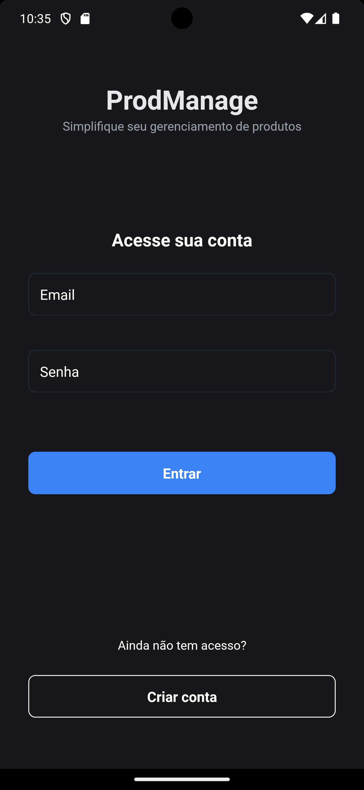
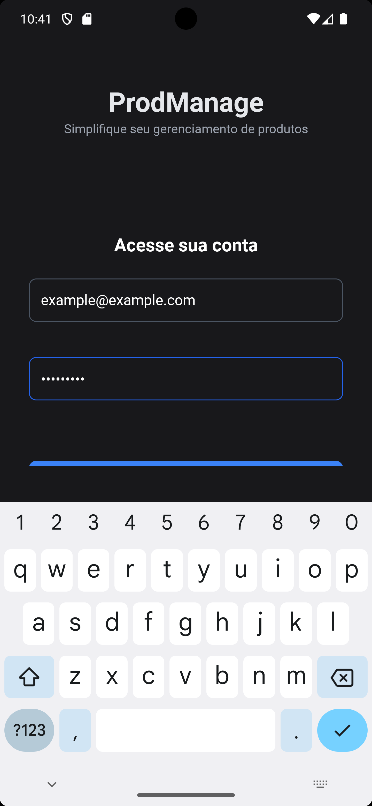
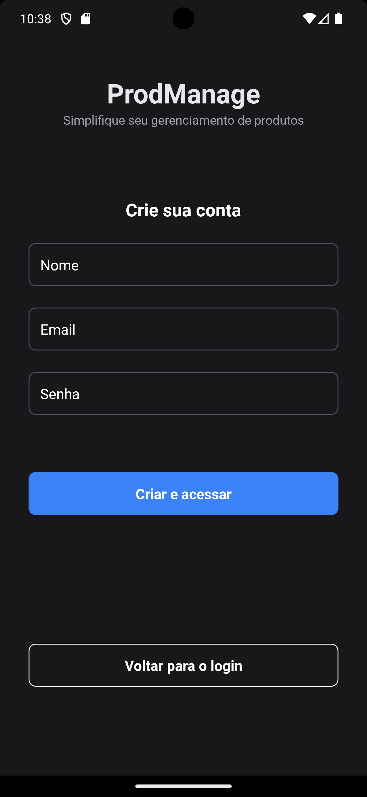
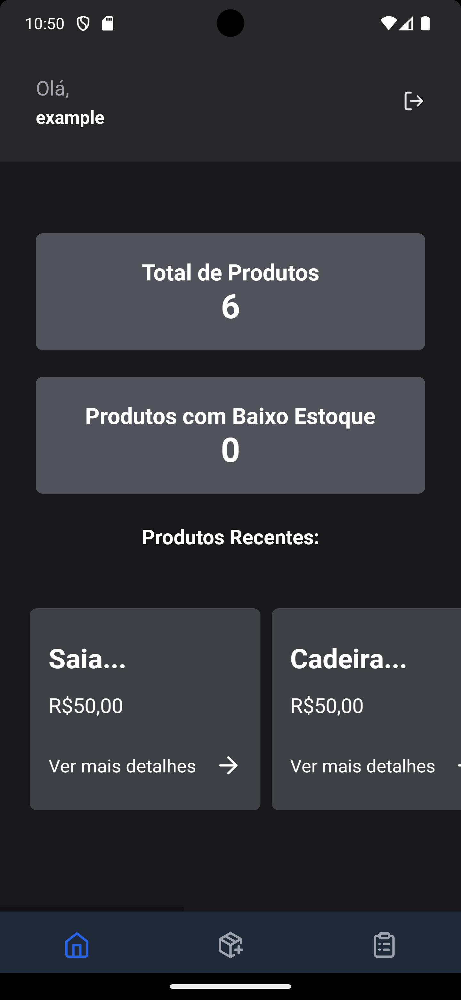
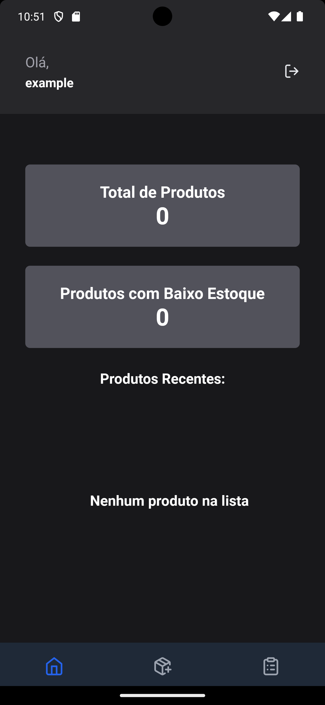
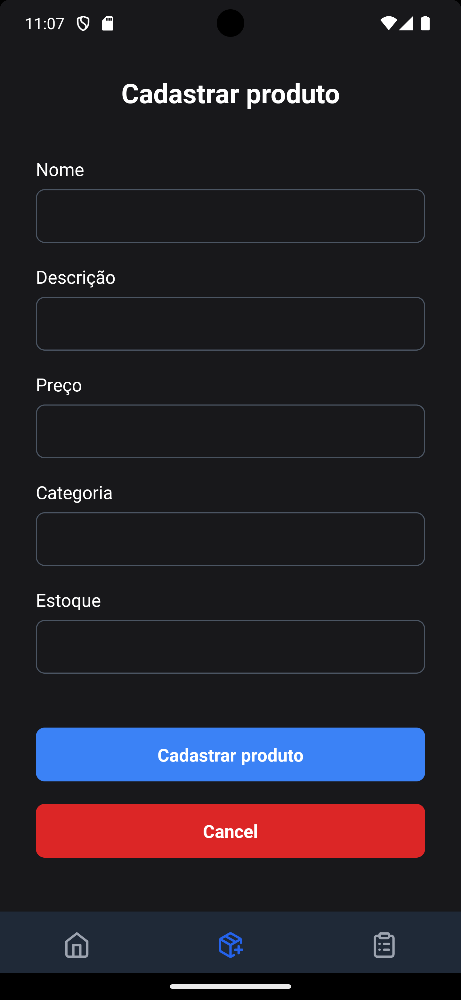
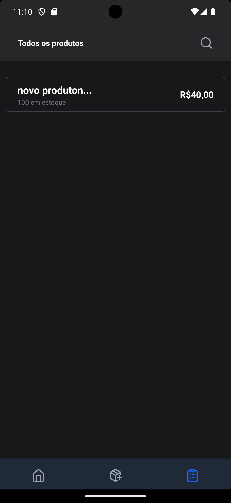
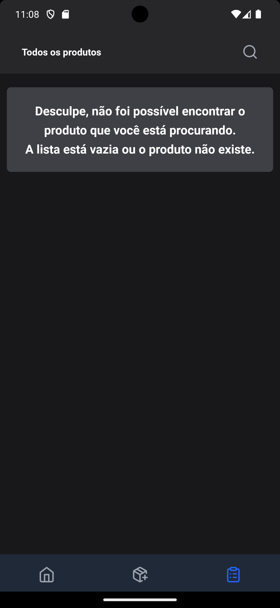
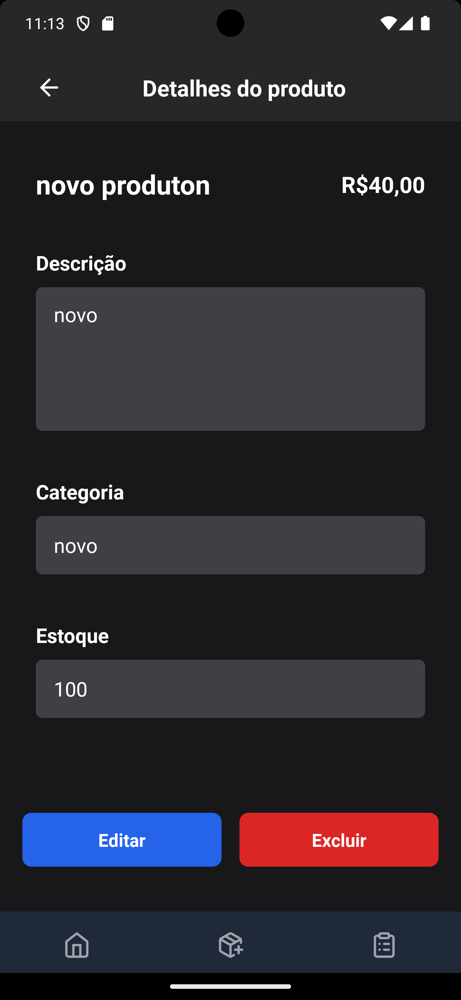
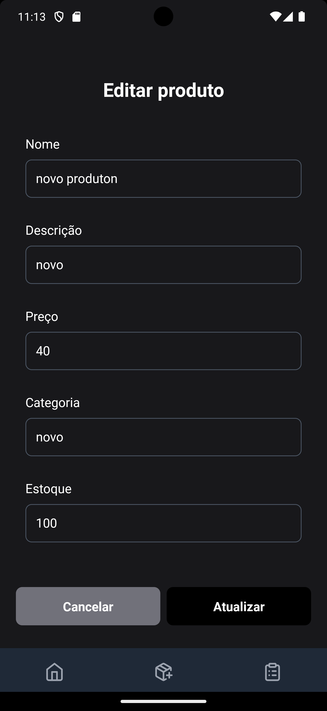

## ProdManage
  - ProdManage é um aplicativo desenvolvido com Expo, React Native e React Navigation para simplificar o gerenciamento de produtos. 
  - Este README fornece instruções sobre como configurar e executar o projeto, além de uma visão geral das funcionalidades implementadas.

## Funcionalidades
  - Login e Cadastro: Permite que usuários façam login ou criem uma nova conta.
  - Gerenciamento de Produtos: Adicione, edite e exclua produtos.
  - Visualização de Produtos: Visualize todos os produtos em uma lista organizada.

# Observação 
  - Este projeto utiliza o JSON Server como simulação de banco de dados para os dados do aplicativo.

## Capturas de Tela

/(./screenshots/login.png)

















## Pré-requisitos
  - Node.js (v14 ou superior)
  - npm (v6 ou superior) ou yarn
  - Expo Go

## Configuração do Projeto

1. - Clonar o Repositório
  ```bash
  git clone https://github.com/seu-usuario/prodmanage.git
  ```
2. - Instalar Dependências
  ```bash
  npm install
  ```
3. - Inicie o projeto com Expo
  ```bash
  npm start
  # ou 
  npx expo start
  ```
# Abra o aplicativo Expo Go no seu dispositivo móvel ou um emulador(android studio)
  - use as opções fornecidas no terminal para abrir o aplicativo Expo Go no seu dispositivo.

# Executar Testes
  ```bash
    npm test
   
  ```
# Estrutura do Projeto
  ```plaintext`
  src/
  ├── components/   # Componentes reutilizáveis
  ├── libs/         #  bibliotecas ou utilitários específicos
  ├── screens/      # Telas do aplicativo
  ├── routes/       # Configuração de navegação
  ├── stores/       # Armazenamento de estado
  └── utils/        # Funções utilitárias

# Contribuição
  -Sinta-se à vontade para contribuir com o projeto. Você pode abrir issues ou enviar pull requests. 
  Para grandes mudanças, por favor, abra uma issue primeiro para discutir o que você gostaria de mudar.

# Licença  
  - Este projeto está licenciado sob a licença MIT. Veja o arquivo LICENSE para mais detalhes.